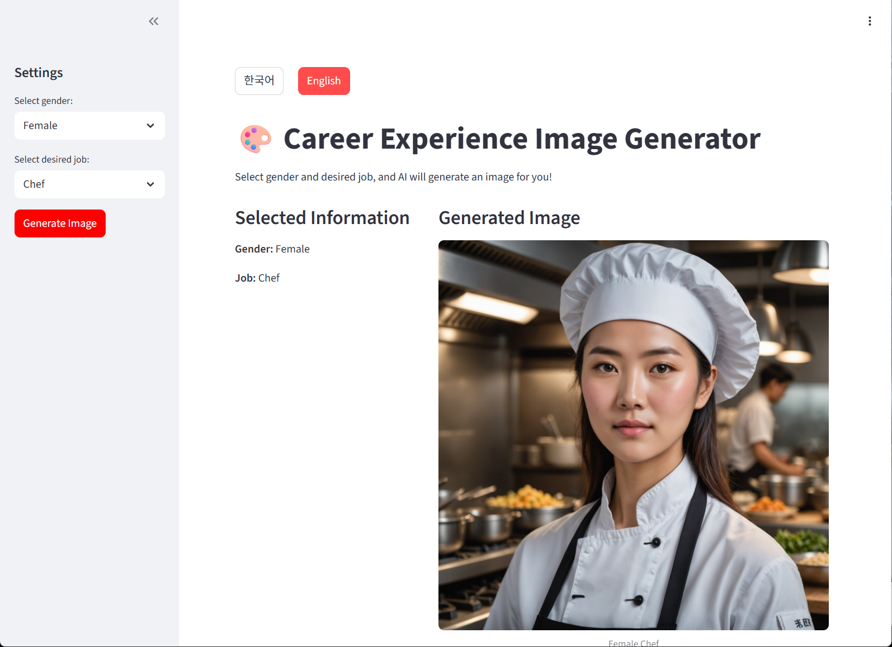
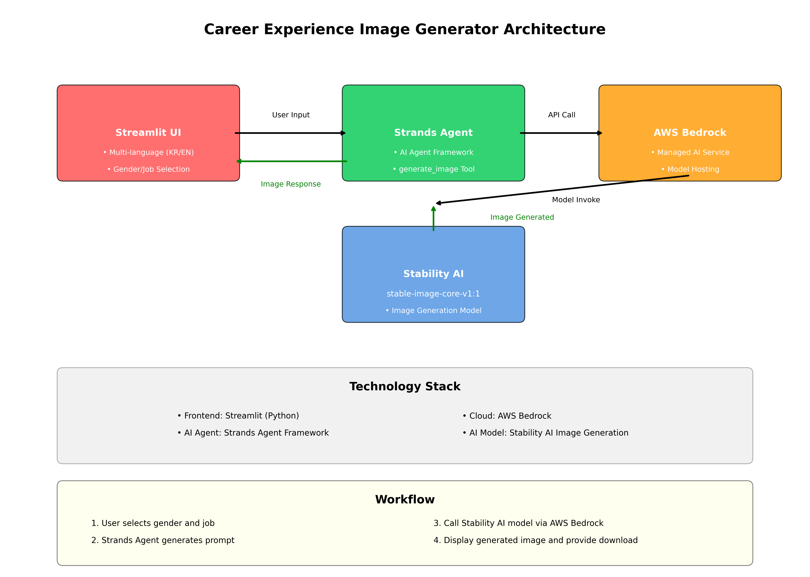

# 직업 체험 이미지 생성기

교육용 웹앱으로 학생들이 성별과 직업을 선택하면 AI가 해당 직업을 가진 사람의 이미지를 생성합니다.

## 주요 기능

- **다국어 지원**: 한국어/영어 UI 제공
- **성별 선택**: 남자/여자 선택 가능
- **직업 선택**: 요리사, 경찰관, 소방관, 우주비행사, 학교 선생님, 의사, 간호사, 파일럿, 과학자, 예술가
- **AI 이미지 생성**: Strands Agent와 Stability AI 모델을 사용한 고품질 이미지 생성
- **이미지 다운로드**: 생성된 이미지를 PNG 파일로 다운로드

## 기술 스택

- **Frontend**: Streamlit (SPA)
- **AI Agent**: Strands Agent
- **이미지 생성**: Stability AI (stability.stable-image-core-v1:1)
- **클라우드**: AWS Bedrock

## 설치 및 실행

### 1. 필수 패키지 설치
```bash
pip install -r requirements.txt
```

### 2. AWS 자격 증명 설정
```bash
aws configure
```
- AWS Access Key ID, Secret Access Key, Region 설정 필요
- AWS Bedrock 서비스 접근 권한 필요
- Stability AI 모델 접근 권한 활성화 필요

### 3. 앱 실행
```bash
streamlit run app.py --server.address 0.0.0.0 --server.port 8501
```

### 4. 브라우저 접근
- Cloud9 환경: Preview → Preview Running Application
- 로컬: http://localhost:8501



## 아키텍쳐 구성도


## 필수 Python 모듈

```
streamlit>=1.28.0
boto3>=1.34.0
pillow>=10.0.0
strands-agents
strands-agents-tools
```

## 사용 방법

1. 웹 브라우저에서 앱 접속
2. 상단에서 언어 선택 (한국어/English)
3. 사이드바에서 성별과 직업 선택
4. "이미지 생성하기" 버튼 클릭
5. 생성된 이미지 확인 및 다운로드

## 주의사항

- AWS 계정과 Bedrock 서비스 접근 권한 필요
- Stability AI 모델 사용 권한이 AWS 콘솔에서 활성화되어야 함
- 인터넷 연결 필요 (AWS API 호출)
